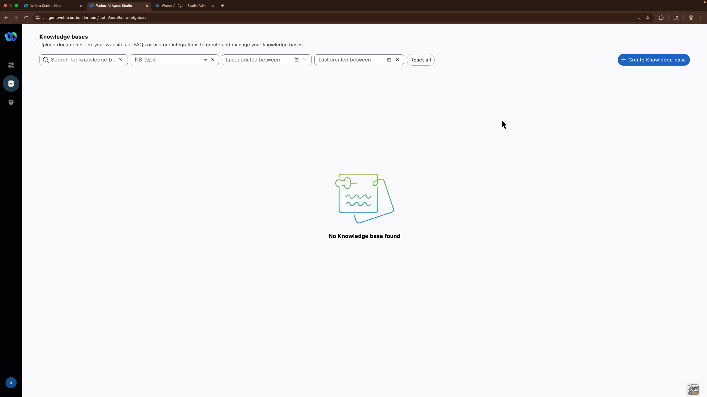

# Lab 1 - Build Your Own AI Agent

## Context
Agentic AI is transforming customer service by enabling systems to proactively resolve issues, deliver personalized assistance, and automate repetitive tasks, boosting efficiency and satisfaction. Despite the complexity behind Agentic AI, Webex AI Agent is designed to be intuitive and easy to use, making it accessible even for IT professionals just beginning their AI journey. Let us prove it to you in this 20 minute lab! 

### High Level Explanation
1. You will upload a knowledge base, and by using Retrieval-Augmented Generation (RAG), the AI Agent ensures its responses are grounded in accurate and relevant data. 
2. You will build your own AI Agent, this will require you to configure the agent's goal. 
3. Once the agent is created, you will update the instructions field and setup a fulfillment action. 
4. Once this is done, everything will be ready to test your AI Agent using our Preview feature. 

!!! Warning "Important"
    We have 2 options available for the creation of the AI agent: 

    1. Use an AI Agent template and generic knowledge base. 
    2. Build your AI Agent from scratch and upload your own knowledge base. 

---
## Build

### Creating a Knowledge Base

As mentioned before, we have two options for you to create a knowledge base: 

a. Create your own KB by collecting information from your company's website (e.g., an FAQ, product guide, etc) and adding it as a document inside a KB.  
b. Upload a generic KB file available in this PC station. 

Select one of the options and follow the instructions: 

??? Note "Use a generic KB"
    1. From the AI Agent Studio, select the notebook icon on the left navigation menu. This is where you will manage your Knowledge Bases. 
    2. Click **Create Knowledge Base**, provide Knowledge base name as <span id="attendee-id">---</span>_AI_KB, then click **Create**.
    3. Go to the **Files** tab and select the option **Add File**. You will find a generic KBs in the Desktop folder, **DrJames_KB.txt**. 
    4. Upload the generic KB and select the option **Process Files**.
    <br>
    <br>
    

??? Note "Create your own KB"
    1. Navigate to your company's website and find the information you would like to include, e.g., FAQ, company policies, PDF with information about a product your company offers, etc. 
    2. From the AI Agent Studio, select the notebook icon on the left navigation menu. This is where you will manage your Knowledge Bases. 
    3. Click **Create Knowledge Base**, provide Knowledge base name as <span id="attendee-id">---</span>_AI_KB, then click **Create**.
    4. Select the **Documents** tab and click the option **+ Create Document**. 
    5. Enter the Document name <span id="attendee-id">---</span>_AI_DOC. Select the option **Add to new category**, name the category anything that matches the information you are adding eg FAQ, product information, etc. 
    6. Copy the content you want to use for your KB from your company's website and paste it in the document you created. If you are copying the content from a website, make sure you only paste the text. Click Save on the top right corner. 
    7. You could also upload a document with public information of your company, simply go to the **Files** tab and select the option **Add File**. Once you upload the file, select the option **Process Files**. 
    <br>
    <br>
    

### Creating an Autonomous AI Agent

??? Note "Create your own AI Agent"
    1. Navigate to **Dashboard** from the right-hand side menu panel and click **Create Agent**
    2. Select **Start from Scratch** and click **Next**
    3. On **Create an AI agent** page select the type of agent: **Autonomous**

    10. A new section called **Add the essential details** will appear. Provide the following information:

        > Agent Name: **<span id="attendee-id">---</span>_AutoAgent**
        >
        > System ID is created automatically
        >
        > AI engine: **Webex AI Pro-US 1.0**
        >
        > Knowledge base: **<span id="attendee-id">---</span>_AI_KB**
    
    5. The **Agent's goal** section depends on what you want your AI Agent to do, but here's a recommended template:
        > You are a <Personality Prompt> <Agent Type> for <Company Name> in the <Industry> industry. You are especially skilled at <Agent Purpose> for <Audience>.
        > Example:  You are a professional FAQ and Knowledge Base Assistant for Webex in the Customer Experience industry. You are specially skilled at answering questions relevant to our Contact Center and CPaaS solutions for our customers.

    11. Once the agent is created, you need to add **Instructions** to orchestrate how the AI Agent will execute an action. There's a pre-configured action that will authenticate you via OTP to your mobile device (US numbers only), these are the instructions:

        ```
        ##Tasks

        ### Authenticate the user via OTP with the action \[generate_OTP\] and \[validate_OTP\]. You can execute the step \[validate_OTP\] only 3 times using different codes from the user. 

        ## Response Guidelines
        Formatting Rules:
        Provide clear, concise responses. Use bullet points or short paragraphs for clarity.
        Language Style: Keep a polite and professional tone.

        ##Completion:
        Ask if the user needs additional help before ending.
        ```

    12. Switch to **Knowledge** tab and from **Knowledge base** drop-down list select **<span id="attendee-id">---</span>_AI_KB**

    13. Click **Save Changes**, then click **Publish**. Provide any version name in popped up window (ex. "1.0").

        

    14. Switch to the **Actions** tab and click the **New action** button. Proceed to name the action **generate_OTP**, add a description and select the action scope option called **Slot filling and fulfillment**. 

    15. Create new input entities for the data required to authenticate, these are the details for each entity: 

        >| Entity Name      | Type     | Value  | Description  |
        >| :--------:       | :-------:| :----: | :---------:  |
        >| name             | string   |    -   | Customer name |
        >| phone_number     | Phone    | **Use default regex**| A valid phone number with country code. 


    16. In the **Webex Connect Flow Builder Fulfillment** section, select the **CCW_Admin_Flows** service and the flow **generate_OTP**. Save your changes. 

    14. click the **New action** button again, and proceed to name the action **validate_OTP**, add a description and select the action scope option called **Slot filling and fulfillment**. 

    15. Create new input entities for the data required to authenticate, these are the details for each entity: 

        >| Entity Name      | Type     | Value  | Description  |
        >| :--------:       | :-------:| :----: | :---------:  |
        >| otp              | string   |    -   | The 6 digit OTP given by the customer |
        >| phone_number     | Phone    | **Use default regex**| A valid phone number with country code. |
        >| transaction      | string   |    -   | transid received in the authenticate_generate_OTP response. Do not ask the user for this |

    16. In the **Webex Connect Flow Builder Fulfillment** section, select the **CCW_Admin_Flows** service and the flow **validate_OTP**. Save your changes. 
    17. You are ready to test your AI Agent. 
    


??? Note "Create AI Agent using a template"
    1. Navigate to **Dashboard** from the right-hand side menu panel and click **Create Agent**.
    2. Select the template called **Doctor's appointment**. 
    3. A new section called **Add the essential details** will appear. Add your attendee ID at the end of the AI agent name **Doctor's appointment - <span id="attendee-id">---</span>** and  edit the **AI engine** field to **Webex AI Pro-US 1.0**. Click the option **Create**.
    4. Switch to **Knowledge** tab and from **Knowledge base** drop-down list select **<span id="attendee-id">---</span>_AI_KB**.
    5. Go to the actions tab and click on each action (except Agent Handover and send_sms) to assign the Webex Connect flow that will execute the action. On the section **Webex Connect Flow Builder Fulfillment**, select the service **CCW_Admin_Flows** and select the flow with the matching name for each action.
    6. Save your changes on each action and select the option **Publish** when you update all the actions.
    7. You are ready to test your AI Agent. 


## Testing

14. Click on **Preview** to test your AI Agent. 
15. If you created you own AI Agent, confirm the authentication via OTP is working and ask questions relevant to the KB you created. 
16. If you used the template, use the following questions as reference or request assistance with an appointment. 


# Once you have completed the testing, let the instructor know.
---

<script src='../assets/load.js'></script>